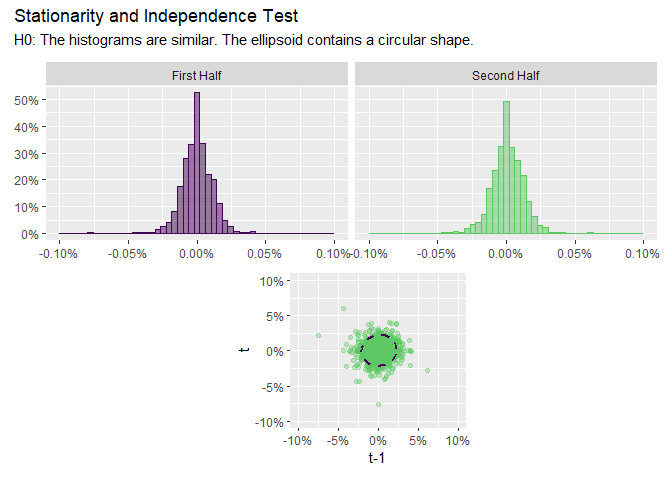
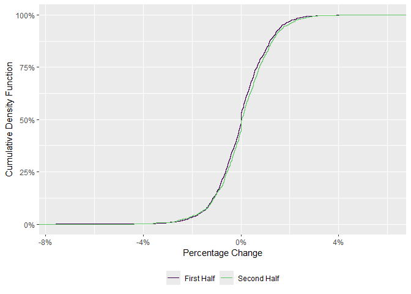

<!-- README.md is generated from README.Rmd. Please edit that file -->

# invariance

<!-- badges: start -->

[](https://lifecycle.r-lib.org/articles/stages.html#experimental)
[](https://github.com/Reckziegel/invariance/actions/workflows/R-CMD-check.yaml)

<!-- badges: end -->

The goal of `invariance` is to help users to perform the first step in
Meucci’s Checklist: **The Quest for Invariance**.

## Installation

You can install the development version of `invariance` from Github with
`devtools`:

``` r
# install.packages("devtools")
devtools::install_github("Reckziegel/invariance")
```

## Example

``` r
library(invariance)
library(tibble)

# Log-returns as candidates for invariance
x <- as_tibble(diff(log(EuStockMarkets)))
x
#> # A tibble: 1,859 x 4
#>         DAX      SMI       CAC      FTSE
#>       <dbl>    <dbl>     <dbl>     <dbl>
#>  1 -0.00933  0.00618 -0.0127    0.00677 
#>  2 -0.00442 -0.00588 -0.0187   -0.00489 
#>  3  0.00900  0.00327 -0.00578   0.00903 
#>  4 -0.00178  0.00148  0.00874   0.00577 
#>  5 -0.00468 -0.00893 -0.00512  -0.00723 
#>  6  0.0124   0.00674  0.0117    0.00852 
#>  7  0.00576  0.0122   0.0131    0.00821 
#>  8 -0.00287 -0.00359 -0.00194   0.000837
#>  9  0.00635  0.0110   0.000171 -0.00523 
#> 10  0.00118  0.00436  0.00313   0.0140  
#> # i 1,849 more rows
```

The main statistics of a time-series can be summarized with
`series_describe`:

``` r
series_describe(x)
#> # A tibble: 4 x 13
#>   asset observations    na minimum quartile_1  median    mean quartile_3 maximum
#>   <chr>        <dbl> <dbl>   <dbl>      <dbl>   <dbl>   <dbl>      <dbl>   <dbl>
#> 1 DAX           1859     0 -0.0963   -0.00469 4.73e-4 6.52e-4    0.00636  0.0508
#> 2 SMI           1859     0 -0.0838   -0.00380 8.86e-4 8.18e-4    0.00607  0.0497
#> 3 CAC           1859     0 -0.0758   -0.00606 0       4.37e-4    0.00710  0.0610
#> 4 FTSE          1859     0 -0.0414   -0.00432 8.02e-5 4.32e-4    0.00525  0.0544
#> # i 4 more variables: variance <dbl>, std <dbl>, skewness <dbl>, kurtosis <dbl>
```

To check if a series is stationary - “invariant” - use
`invariance_test:`

``` r
# must be univariate
invariance_test(x["CAC"])
```



For “invariant” time-series the shape of the ellipsoid should be
circular and the histograms should look the same.

To test if a distribution shows any evidence of changing behavior due to
structural breaks, regime shifts, etc. use `ks_test`:

``` r
ks_test(x[ , "CAC"])
#> 
#>  Two-sample Kolmogorov-Smirnov test
#> 
#> data:  x and y
#> D = 0.045779, p-value = 0.2843
#> alternative hypothesis: two-sided
```



If the two pieces of the distribution are statistically different a
Bayesian estimation technique may be recommended in the next step of the
Checklist: **Estimation**.

## Reference

- Meucci, Attilio, ‘The Prayer’ Ten-Step Checklist for Advanced Risk and
  Portfolio Management (February 2, 2011). Available at SSRN:
  <https://ssrn.com/abstract=1753788> or
  <http://dx.doi.org/10.2139/ssrn.1753788>
